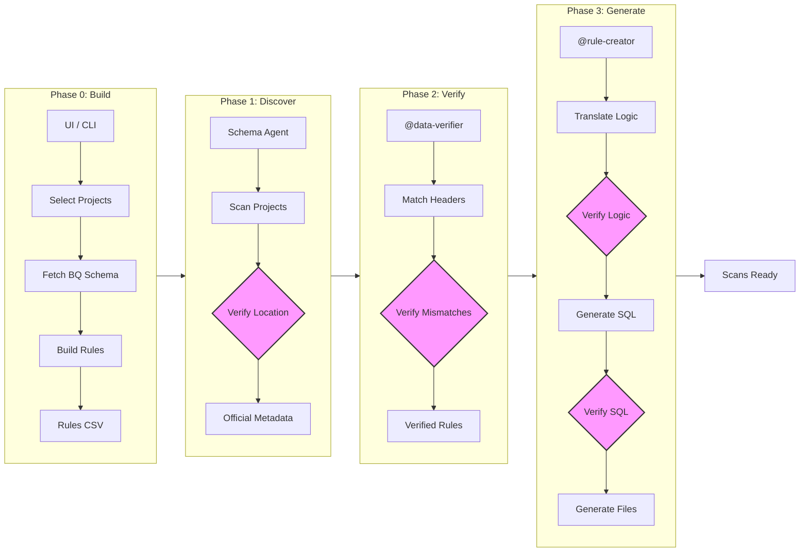

# Dataplex Master Pipeline

This is the centralized hub for the **Dataplex End-to-End Scan Creation System**. 

## **End-to-End Workflow Diagram**

## **The Master Orchestrator**
**Tool:** `master_hub_ui.py` (Streamlit)
- **Purpose:** A single entry point to run all 4 phases of the pipeline.
- **Features:** Centralized proxy management, interactive verification, and automated file generation.

## **The Four-Phase Pipeline**
...

### **Phase 0: Rule Building (UI)**
**Tool:** `Rule creator/rule_builder_ui.py` (Streamlit)
- **Purpose:** Create your rules file from scratch using a dynamic UI.
- **Verification Step:** The UI fetches live schemas from BigQuery. You review every rule in a dynamic table before saving.

### **Phase 1: Discovery (Schema Alignment)**
...

### **Phase 2: Verification (Rule Cleansing)**
**Agent:** `@data-verifier`
- **Purpose:** Cross-reference your Rules File against your actual Data Files.
- **Verification Step:** 
    - The agent will list every mismatch found (casing, spaces, missing columns).
    - It will propose a correction plan and **must wait for your explicit approval** before modifying any file.

### **Phase 3: Generation (Config Creation)**
**Agent:** `@rule-creator`
- **Purpose:** Translate natural language business logic into Dataplex YAML and Batch files.
- **Verification Step:**
    - The agent will translate your "Rule_Logic" into BigQuery SQL.
    - **MANDATORY:** It will display the proposed SQL and parameter mappings.
    - **Confirmation Required:** You must review and approve the SQL logic before the `.yaml` and `.bat` files are generated.

---

## **Directory Structure**
- `/Schema`: BigQuery discovery tools.
- `/Verification`: Rule-to-Data matching agents.
- `/Rule creator`: Logic-to-YAML/Batch translation agents.
- `/outputs`: (Automated) Structured, table-specific artifacts (YAML, Batch, Schemas).
- `/logs`: (Automated) Timestamped audit logs for every execution step.
